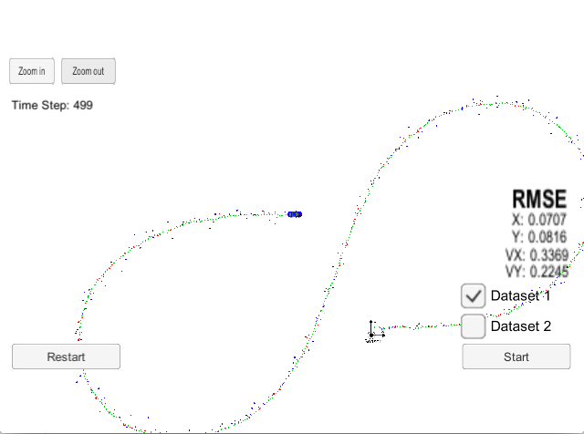
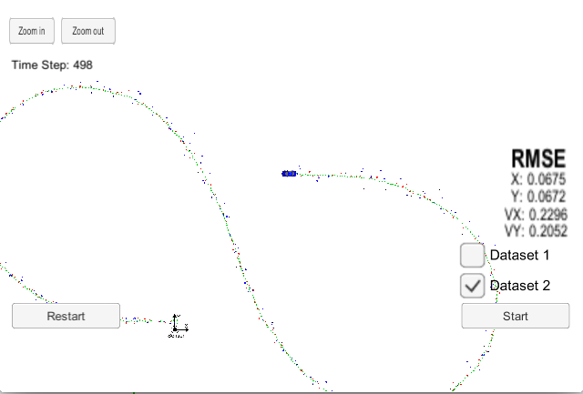

# Unscented Kalman Filter
This Project is the seventh task (Project 2 of Term 2) of the Udacity Self-Driving Car Nanodegree program. The main goal of the project is to apply Unscented Kalman Filter to fuse data from LIDAR and Radar sensors of a self driving car using C++.

The project was created with the Udacity [Starter Code](https://github.com/udacity/CarND-Unscented-Kalman-Filter-Project).

---

## Content of this repo
- `scr`  a directory with the project code:
- `main.cpp` - reads in data, calls a function to run the Kalman filter, calls a function to calculate RMSE
- `ukf.cpp` - the UKF filter itself, defines the predict function, the update function for lidar, and the update function for radar
- `tools.cpp` - a function to calculate RMSE
- `data`  a directory with two input files, provided by Udacity
- `results`  a directory with output files

## Results
Input 1 Results


RMSE = [0.0707, 0.0816, 0.3369, 0.2245]

Threshold: RMSE <= [0.09, 0.10, 0.40, 0.30]

Input 2 Results


RMSE = [0.0675 0.0672 0.2296 0.2052]

Threshold: RMSE <= [0.09, 0.10, 0.40, 0.30]

## Dependencies

* cmake >= v3.5
* make >= v4.1
* gcc/g++ >= v5.4

## How to run the code
Clone this repo and perform
```
mkdir build && cd build
cmake .. && make
./ExtendedKF ../data/sample-laser-radar-measurement-data-1.txt output1.txt > input1.log
./ExtendedKF ../data/sample-laser-radar-measurement-data-2.txt output2.txt > input2.log
```

